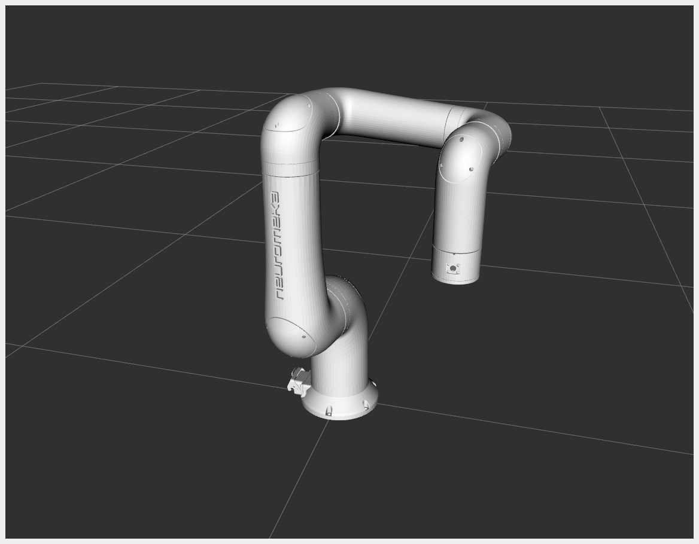
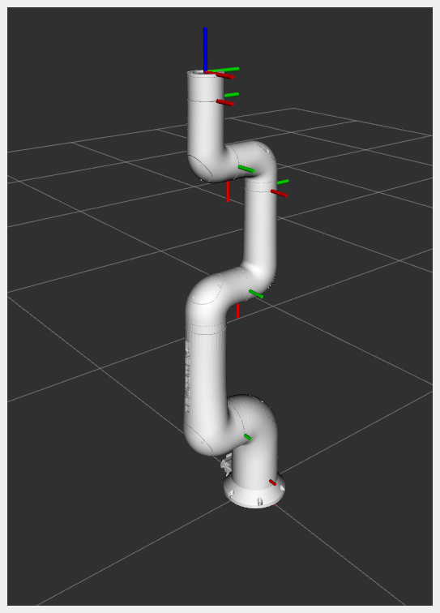
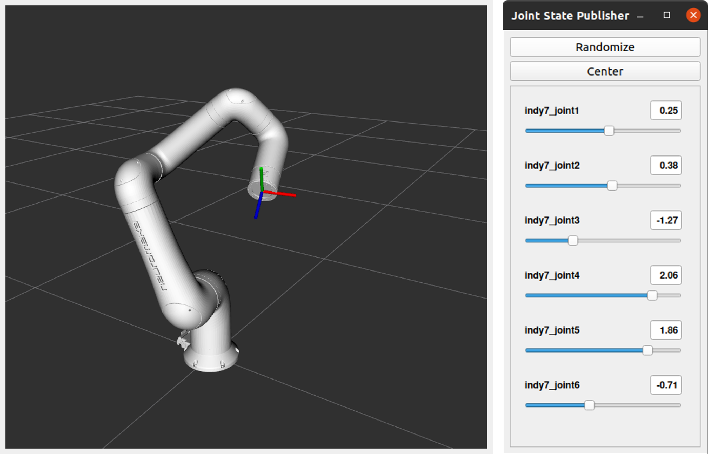

# indy7_ign
This package contains model files (urdf, sdf) for loading indy7 in ROS2 and Ignition Gazebo environments.

<!--

-->
The coordinate system and location of each link in indy7 are as follows.



# Install & Build
The following commands download a package from a remote repository and install it in your colcon workspace.

```bash
mkdir -p ~/robot_ws/src # Make colcon workespace directory. If colcon workspace does not exist, run this command.
cd ~/robot_ws/src
git clone https://github.com/HYU-PBLRC-PB1/indy7_ign.git # Download the package from the remote repository.
cd ~/robot_ws && colcon build --symlink-install # Build colcon workspace.
```

# Example
This is an example of using the 'joint_state_publisher_gui' node to check the configuration of indy7.
```bash
source ~/robot_ws/install/setup.bash
ros2 launch indy7_ign indy7_display.launch.py
```
You can check the posture of indy7 by directly entering each joint angle value or using the slider.

(* If you want to check the coordinate system of a specific link as shown in the picture, activate the Show Axes option in rviz2.)

## Error 
If there is an error that the 'joint-state-publisher-gui' package cannot be found, 
run the following command to install the joint-state-publisher-gui package and try again.
```bash
sudo apt-get install ros-foxy-joint-state-publisher-gui
ros2 launch indy7_ign indy7_display.launch.py
```

# Package Structure
If you want to check the file structure of a package, run the following command.
```bash
cd ~/robot_ws/src/indy7_ign
tree
```

```bash
indy7_ign
├── CMakeLists.txt
├── indy7
│   ├── meshes # urdf 및 sdf에서 참조하는 mesh 파일
│   │   ├── collision
│   │   │   ├── link0.stl
│   │   │   ├── link1.stl
│   │   │   ├── link2.stl
│   │   │   ├── link3.stl
│   │   │   ├── link4.stl
│   │   │   ├── link5.stl
│   │   │   └── link6.stl
│   │   └── visual
│   │       ├── link0.stl
│   │       ├── link1.stl
│   │       ├── link2.stl
│   │       ├── link3.stl
│   │       ├── link4.stl
│   │       ├── link5.stl
│   │       └── link6.stl
│   ├── model.config # Ignition model meta file
│   ├── model.sdf # SDF description of the indy7
│   └── thumbnails
│       └── 1.png
├── LICENSE
├── package.xml
├── README.md
├── scripts
│   ├── estimate_inertial_properties.py
│   └── indy7_inertial_out.sdf
└── urdf
    └── indy7.urdf
```
